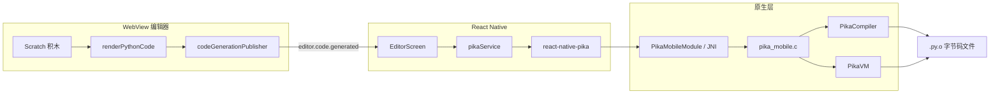

# PikaScript 编译与本地运行（轨道 A）

本文档描述 Scratch 移动端当前已落地的 **Python 编译 + 手机本地执行** 链路，以及相关封装 API，供后续成员查阅与扩展。

> **当前范围**：轨道 A（编译 / 本地调试）。轨道 B（BLE 连接、字节码下发到主机）尚未实现。

---

## 1. 整体链路



### 数据流步骤

| 步骤 | 位置 | 说明 |
|------|------|------|
| 1 | `packages/scratch-editor-web/src/codegen/` | 积木工作区 → Python 源码字符串 |
| 2 | `packages/scratch-editor-web/src/bridge/codeGenerationPublisher.ts` | 防抖 200ms，通过 `postMessage` 发送 `editor.code.generated` |
| 3 | `apps/mobile/src/screens/EditorScreen/EditorScreen.tsx` | 接收消息，存入 `generatedCode` state，代码面板展示 |
| 4 | `apps/mobile/src/services/pika/pikaService.ts` | 业务封装：校验源码、统一成功/失败结构 |
| 5 | `packages/pika-bytecode/react-native-pika/` | JS → NativeModules `PikaMobile` |
| 6 | `packages/pika-bytecode/mobile/pika_mobile.c` | 调用 `pikaCompile` / `obj_run` / `pikaVM_runByteCode` |

---

## 2. 目录与依赖

```
packages/pika-bytecode/          # vendor，源自 ELE-byteCode
  mobile/pika_mobile.{c,h}       # C API
  pikascript/                    # PikaScript v1.13.4 运行时
  react-native-pika/             # RN 原生模块（Yarn workspace）

apps/mobile/src/services/pika/   # 业务封装（推荐 UI / 服务层只调这里）
  pikaService.ts
  index.ts
```

- `apps/mobile/package.json` 依赖 `"react-native-pika": "0.1.0"`
- 根 `package.json` workspaces 包含 `packages/pika-bytecode/react-native-pika`

---

## 3. 字节码格式（`.py.o`）

编译产物为 **PikaScript 专有字节码**，不是 `.so` 共享库。

| 字段 | 值 |
|------|-----|
| Magic | `0x0f 70 79 6f`（hex: `0f70796f`，即 `0x0f` + `"pyo"`） |
| 默认输出路径（Android） | `{filesDir}/pika-main.py.o` |
| 默认输出路径（iOS） | `{Documents}/pika-main.py.o` |

编译成功时，代码面板会显示字节数及 hex 前缀。合法前缀应以 `0f70796f` 开头。

---

## 4. 原生模块 API（`react-native-pika`）

路径：`packages/pika-bytecode/react-native-pika/src/index.ts`

通过 `NativeModules.PikaMobile`（Legacy 桥接）调用，**非 TurboModule**。

### 类型

```typescript
type PikaResult = {
  code: number;        // 0 表示成功（PIKA_RES_OK）
  message: string;
  data?: string;       // 编译成功后可能携带文件内容
  dataEncoding?: 'utf8' | 'base64' | 'hex';  // Android 编译结果为 hex
};
```

### 函数

| 函数 | 签名 | 说明 |
|------|------|------|
| `compile` | `(source: string, outputPath?: string \| null) => Promise<PikaResult>` | Python 源码 → 写入 `outputPath`；`outputPath` 为空时由原生层使用默认路径 |
| `execute` | `(source: string) => Promise<PikaResult>` | 在手机 VM 中直接执行 Python 源码 |
| `executeBytecode` | `(path: string) => Promise<PikaResult>` | 加载 `.py.o` 文件并执行 |
| `readFile` | `(path: string) => Promise<PikaResult>` | 读取字节码文件，`data` 为 hex（Android） |
| `getDefaultBytecodePath` | `() => Promise<string>` | 返回当前平台默认 `.py.o` 绝对路径 |

### 使用示例

```typescript
import {
  compile,
  execute,
  executeBytecode,
  getDefaultBytecodePath,
} from 'react-native-pika';

const path = await getDefaultBytecodePath();
const compiled = await compile("print('hello')\n", path);
if (compiled.code !== 0) {
  throw new Error(compiled.message);
}

await execute("print('hello')\n");
await executeBytecode(path);
```

---

## 5. 业务封装 API（`pikaService`）

路径：`apps/mobile/src/services/pika/`

**推荐**：页面、服务层优先调用此层，而不是直接调 `react-native-pika`。该层负责空代码校验、默认路径、hex 解析与用户可读错误信息。

### 导出

```typescript
import {
  compileGeneratedCode,
  runGeneratedCode,
  runCompiledBytecode,
  type PikaCompileOutcome,
  type PikaRunOutcome,
} from '../../services/pika';
```

### 类型

```typescript
type PikaCompileOutcome = {
  ok: boolean;
  message: string;
  bytecodePath: string | null;  // 成功时为绝对路径，可供 executeBytecode 使用
  bytecodeSize: number;       // 字节码字节数
  hexPreview: string;         // 前 16 字节的 hex，用于快速校验 magic
};

type PikaRunOutcome = {
  ok: boolean;
  message: string;
};
```

### 函数

#### `compileGeneratedCode(source, outputPath?)`

将编辑器生成的 Python 编译为 `.py.o`。

| 参数 | 说明 |
|------|------|
| `source` | Python 源码字符串 |
| `outputPath` | 可选；省略时自动 `getDefaultBytecodePath()` |

| 前置校验 | 行为 |
|----------|------|
| 空字符串 | `ok: false`，`message: '暂无有效 Python 代码'` |
| 以 `//` 开头（占位注释） | 同上 |

| 返回值字段 | 说明 |
|------------|------|
| `ok` | `result.code === 0` |
| `bytecodePath` | 成功时保留路径，供后续 `runCompiledBytecode` |
| `bytecodeSize` | 从 `PikaResult.data`（hex）解码后的长度 |
| `hexPreview` | 前 16 字节 hex，正常应以 `0f70796f` 开头 |

#### `runGeneratedCode(source)`

不编译，直接在手机 VM 执行源码。

| 前置校验 | 同 `compileGeneratedCode` |
| 成功 | `ok: true`，`message` 通常为 `'ok'` |
| 失败 | `ok: false`，`message` 为 PikaScript 错误描述 |

#### `runCompiledBytecode(bytecodePath)`

执行已编译的 `.py.o` 文件。

| 前置校验 | `bytecodePath` 为空 → `ok: false`，`'请先编译生成字节码'` |
| 典型用法 | 先 `compileGeneratedCode`，再传入返回的 `bytecodePath` |

### 使用示例

```typescript
const source = generatedCode; // 来自 editor.code.generated

const compiled = await compileGeneratedCode(source);
if (!compiled.ok) {
  console.warn(compiled.message);
  return;
}
console.log(`字节码 ${compiled.bytecodeSize} B，前缀 ${compiled.hexPreview}`);

const runSrc = await runGeneratedCode(source);
if (!runSrc.ok) {
  console.warn(runSrc.message);
}

const runBc = await runCompiledBytecode(compiled.bytecodePath!);
if (!runBc.ok) {
  console.warn(runBc.message);
}
```

---

## 6. 编辑器 UI 集成

路径：`apps/mobile/src/screens/EditorScreen/EditorScreen.tsx`

代码面板（右上角代码图标打开）提供三个按钮：

| 按钮 | 调用 | 用户可见反馈 |
|------|------|--------------|
| **编译** | `compileGeneratedCode(generatedCode)` | 绿色「编译成功：N 字节，前缀 0f70796f…」 |
| **运行源码** | `runGeneratedCode(generatedCode)` | 绿色「源码运行完成（print 输出见终端 logcat）」或红色错误 |
| **运行字节码** | `runCompiledBytecode(bytecodePath)` | 需先编译成功；反馈同上 |

`generatedCode` 变化时会重置编译状态（需重新编译）。

---

## 7. 限制与注意事项

### 手机本地 VM 无设备 API

Codegen 生成的 Python 使用固件模块（`_motor`、`_key`、`_matrix` 等，见 `packages/scratch-editor-web/src/codegen/moduleCall.ts`）。当前 vendor 的 `pikascript-api` 仅含 `PikaStdLib`。

| 操作 | 含硬件 API 的脚本 |
|------|-------------------|
| **编译** | 通常可成功（编译器做语法级处理） |
| **运行源码 / 运行字节码** | 大概率失败（VM 无 `_motor` 等绑定） |

含硬件调用的程序，最终应在**主机固件**上执行；轨道 B 将通过 BLE 下发 `.py.o`。

### `print` 输出不在 App 界面

`print()` 走 PikaScript 底层 `pika_platform_printf`，输出到系统日志。查看方式：

```bash
yarn logs:mobile
```

### 开发时 Hooks 顺序报错

给 `EditorScreen` 新增 `useState` 后，Fast Refresh 可能触发 Hooks 顺序警告。解决：**完全重载 App**（`yarn start --reset-cache` 或重新 `yarn android`），不要只依赖热更新。

### 修改原生代码后

```bash
yarn install
yarn android   # 或 yarn ios（需 pod install）
```

Android NDK 编译 `react-native-pika` 时，`CMakeLists.txt` 使用 `REALPATH` 解析 `PIKA_ROOT`，以兼容 Yarn workspace 符号链接。

---

## 8. 后续扩展（轨道 B 预留）

| 能力 | 状态 | 建议接入点 |
|------|------|------------|
| BLE 扫描 / 连接主机 | 未做 | `apps/mobile/src/services/ble/` |
| 字节码分片下发 | 未做 | 扩展 `packages/protocol`，读取 `compileGeneratedCode` 产物 |
| 上传按钮 | 未做 | `EditorScreen`，依赖 BLE 连接就绪后启用 |

---

## 9. 相关文件索引

| 文件 | 职责 |
|------|------|
| [packages/scratch-editor-web/src/codegen/generators.ts](../packages/scratch-editor-web/src/codegen/generators.ts) | `renderPythonCode()` |
| [packages/shared/src/types/editorBridge.ts](../packages/shared/src/types/editorBridge.ts) | `editor.code.generated` 消息类型 |
| [apps/mobile/src/services/pika/pikaService.ts](../apps/mobile/src/services/pika/pikaService.ts) | 业务封装 |
| [packages/pika-bytecode/react-native-pika/src/index.ts](../packages/pika-bytecode/react-native-pika/src/index.ts) | 原生 JS API |
| [packages/pika-bytecode/mobile/pika_mobile.c](../packages/pika-bytecode/mobile/pika_mobile.c) | C API 实现 |
| [packages/pika-bytecode/pikascript/pikascript-core/PikaCompiler.c](../packages/pika-bytecode/pikascript/pikascript-core/PikaCompiler.c) | 编译器核心 |
| [docs/module-boundary.md](./module-boundary.md) | 模块边界（BLE / 原生放 `apps/mobile`） |
